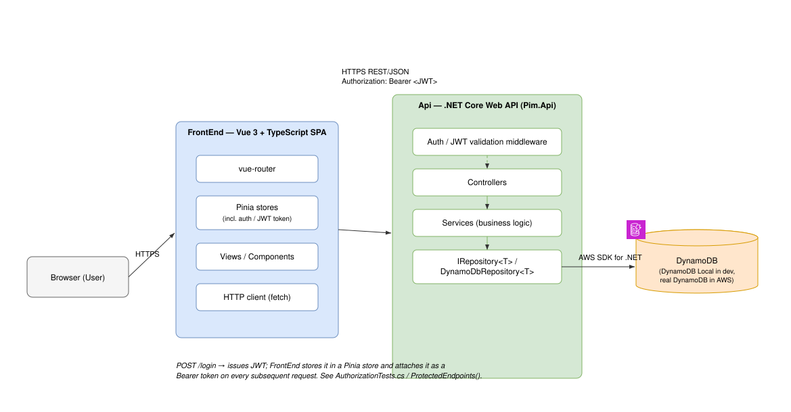
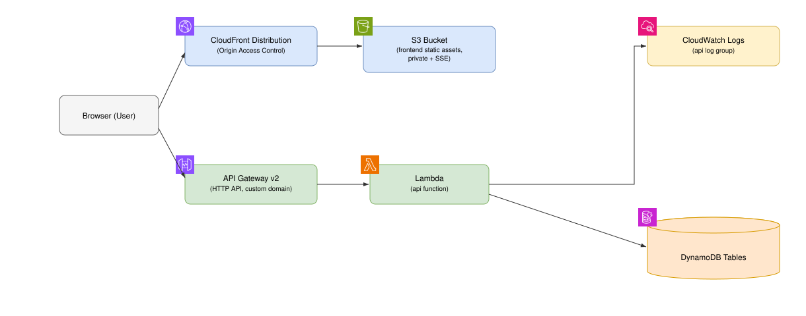

# Architecture diagrams

Two diagrams covering the overall structure of PIM, per [UBE-12](https://linear.app/uberconcept/issue/UBE-12/create-basic-documentation).

**Format:** [draw.io / diagrams.net](https://www.diagrams.net/) XML (`.drawio`). Each diagram has a
matching `.svg` export in this folder so it's viewable directly on GitHub/in an editor without the
draw.io app — open the `.drawio` file (desktop app, VS Code draw.io extension, or
[app.diagrams.net](https://app.diagrams.net/)) to edit it, then re-export the `.svg` after changes.
AWS service boxes carry the real AWS Architecture Service icon (S3, CloudFront, CloudWatch, VPC,
Lambda, API Gateway, DynamoDB), embedded as an inline base64 SVG image so it renders identically in
both the `.drawio` and `.svg` — no dependency on draw.io's shape libraries. Icon source: the
official AWS icon set as packaged by the (MIT-licensed) [`aws-icons`](https://www.npmjs.com/package/aws-icons)
npm package.

## Logical structure

[`logical-architecture.drawio`](./logical-architecture.drawio) / [`logical-architecture.svg`](./logical-architecture.svg)

Shows the request path from the browser through the Vue 3 SPA (`FrontEnd/`) to the .NET Core Web
API (`Api/`) and down to DynamoDB via the generic `IRepository<T>` / `DynamoDbRepository<T>`
abstraction. The FrontEnd authenticates via `/login`, which issues a JWT; the FrontEnd stores it in
a Pinia store and sends it as a `Bearer` token on every subsequent request, which the Api validates
before routing into controllers/services.

## AWS infrastructure

[`aws-infrastructure.drawio`](./aws-infrastructure.drawio) / [`aws-infrastructure.svg`](./aws-infrastructure.svg)

Derived from `Terraform/main.tf` and its modules (`Terraform/modules/{frontend,api,networking,data}`):

- **Frontend** — CloudFront (with Origin Access Control) in front of a private, encrypted S3
  bucket serving the built SPA, on a custom domain with an ACM certificate.
- **Api** — API Gateway v2 (HTTP API, custom domain) invoking a Lambda function that runs inside
  the VPC's private subnets, logging to CloudWatch.
- **Networking** — a VPC with private subnets, route tables, and NACLs; the Lambda reaches
  DynamoDB over a gateway VPC endpoint rather than through a NAT/internet gateway.
- **Data** — four DynamoDB tables: `User`, `TransactionMonth`, `TransactionDescriptions`,
  `DescriptionMapping`.

Not shown: `Terraform/bootstrap` (the S3 state bucket, applied manually/serially before the root
config works), and CI/CD — GitHub Actions deploys via an OIDC-assumed IAM role, deliberately created
and documented outside Terraform (see the CI AWS auth notes in `docs/worklogs`).
